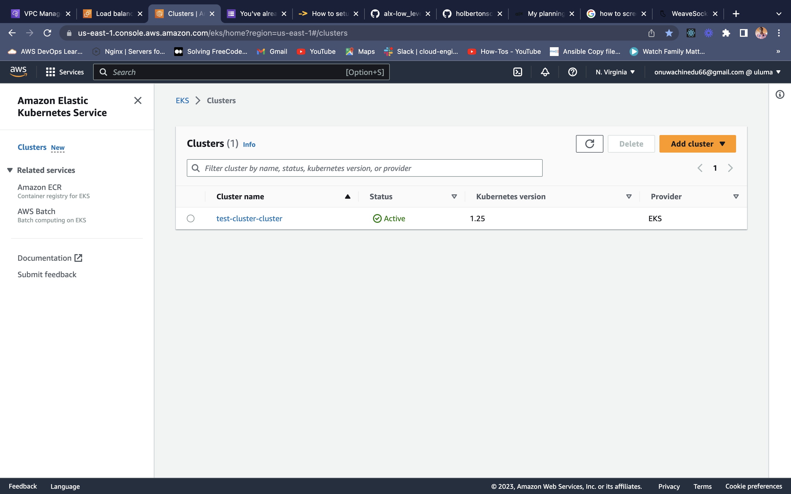
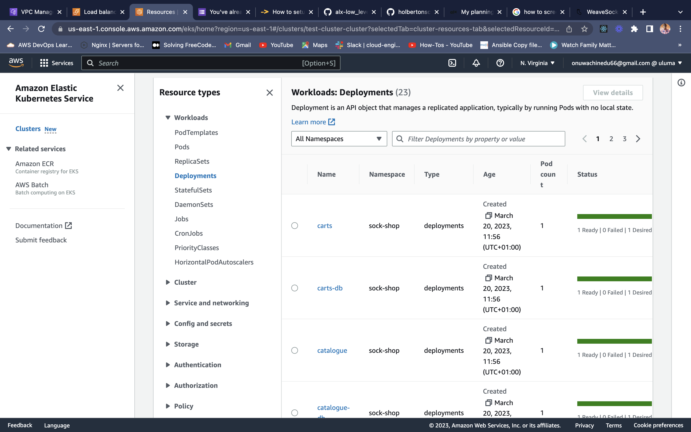
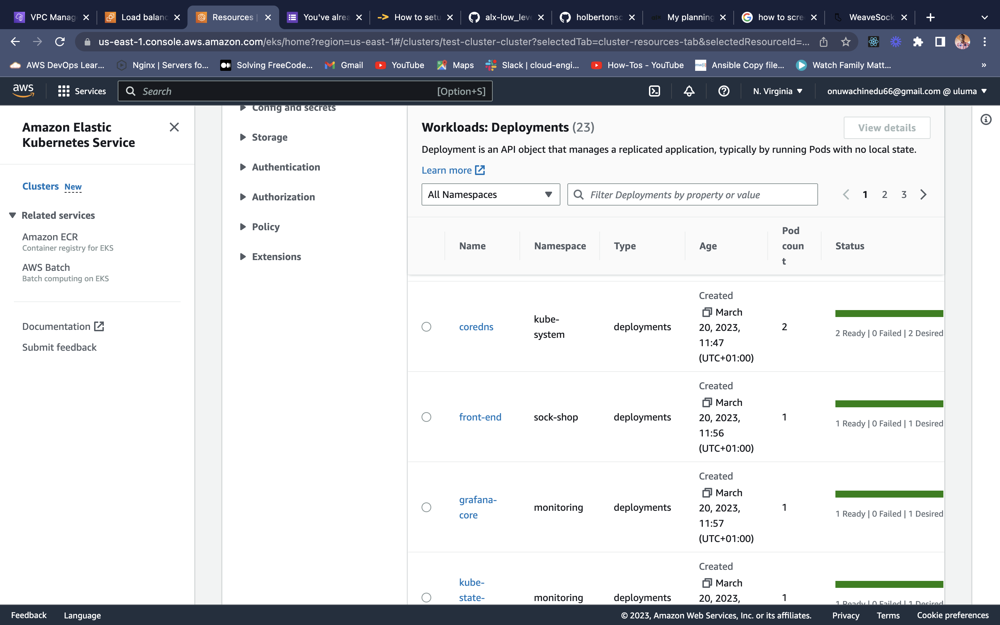
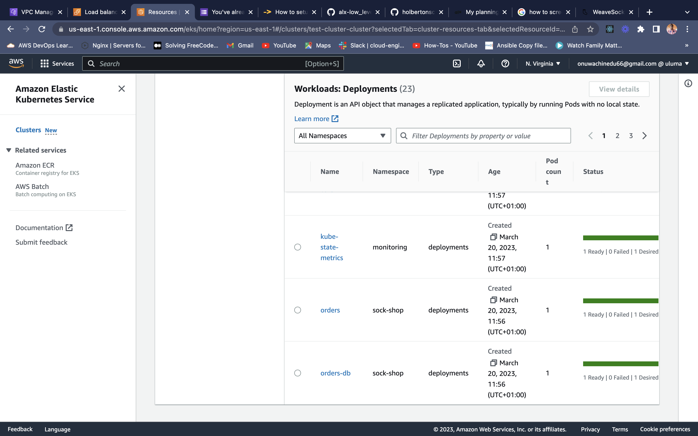
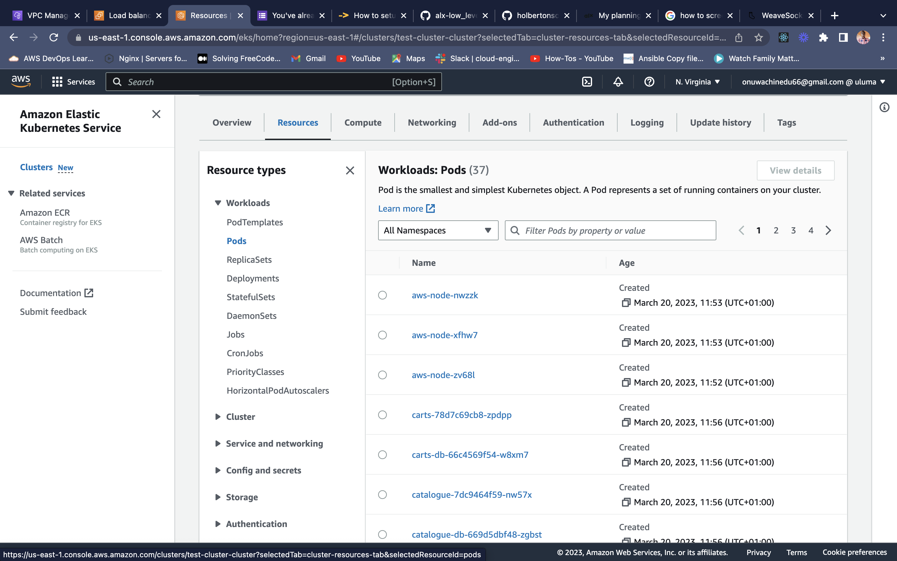
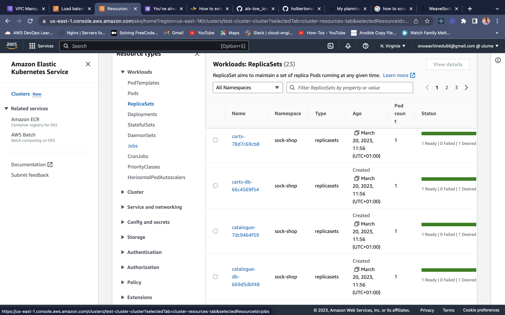
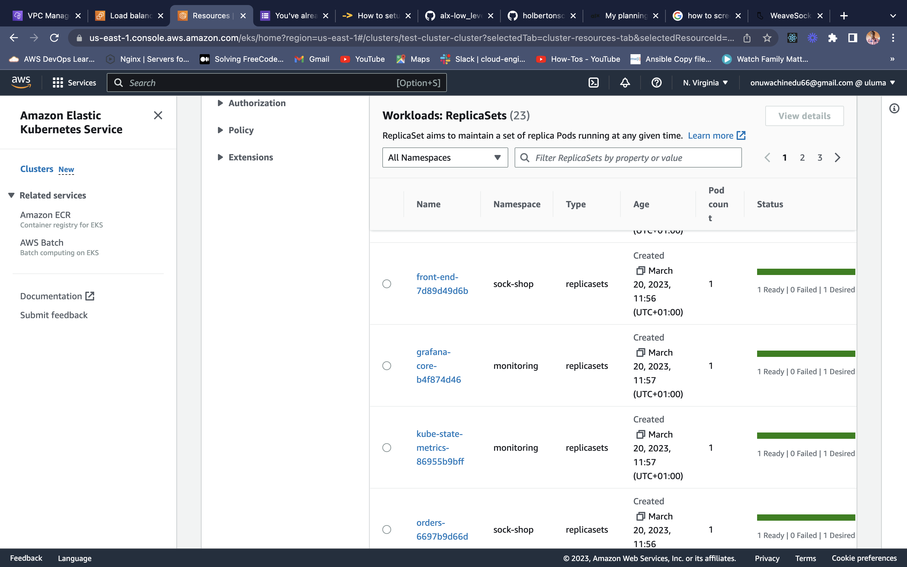
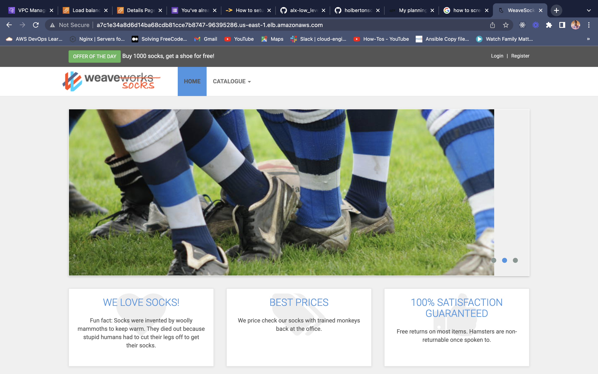
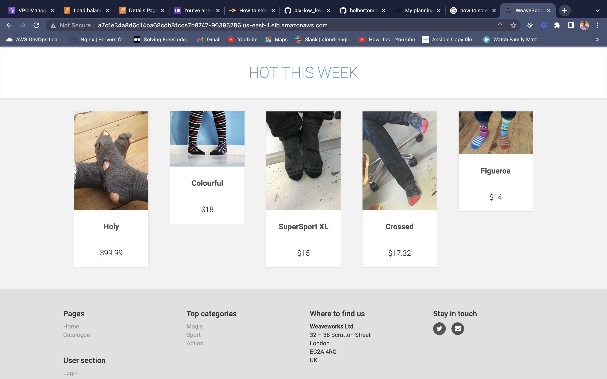

## This file contains pictorial details about the cluster I deployed
## The terraform apply results are contained in the folder terraform apply output
## The results of the deployments are as follows
<ul>
    <li>Cluster Name 
    <li> Deployments  
    
    
    <li> Pods </li>
    
    <li>ReplicaSets </li>
    
    
    <li> Sock Shop Frontend </li>
    
    
<ul>